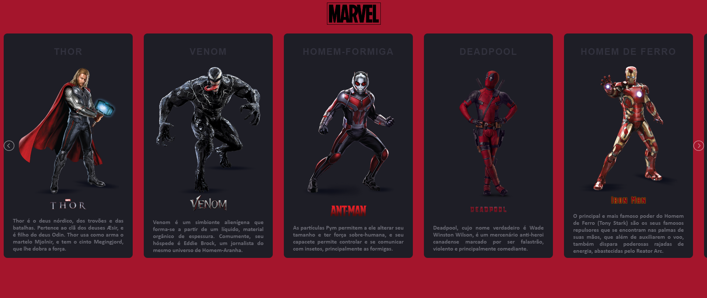

<h1 align="center"> MARVEL CARDS </h1>

  <a href="#-tecnologias">Tecnologias</a>&nbsp;&nbsp;&nbsp;|&nbsp;&nbsp;&nbsp;
  <a href="#-projeto">Projeto</a>&nbsp;&nbsp;&nbsp;|&nbsp;&nbsp;&nbsp;

 

  

## 🚀 Tecnologias

Esse projeto foi desenvolvido com as seguintes tecnologias:

- HTML e CSS
- JavaScript
- [Node e NPM](https://nodejs.org/)
- [Vercel](https://marvel-cards-ebon.vercel.app/)

## 💻 Projeto

O projeto tem como objetivo apresentar alguns dos personagens do universo da Marvel Comics através de cartões em um carrossel de imagens. A cor do nome do personagem muda conforme a cor mais evidente de seu traje.  

[CLIQUE AQUI](https://marvel-cards-ebon.vercel.app/) PARA VISUALIZAR O PROJETO!

